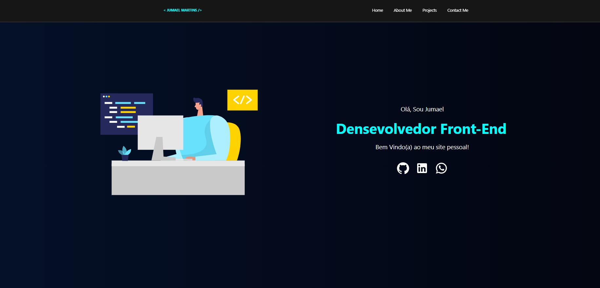

# Portifolio Web-Page
Olá, esse projeto é um website no estilo Portfolio pessoal. Aqui você encontrara informações sobre mim e verá alguns de meus projetos, tambem encontra o link para minhas redes sociais para poder me localizar. :D

## Lista de Condeudo

- [Visão Geral](#visão-geral)
  - [Projeto](#projeto)
  - [Screenshot](#screenshot)
  - [Links](#links)
- [Desenvolvimento](#desenvolvimento)
  - [Ferramentas utilizadas](#ferramentas-utilizadas)
  - [Aprendizado](#o-que-aprendi)
- [Onde Me Encontrar?](#redes-sociais)

## Visão Geral

### Projeto

Usuario será capaz de:

Já implementado:

- Navegar entre as paginas Home, About, Projects e Contact,
- Ser direcionado as Redes sociais ao clica nos links
- Ser direcionado ao site com o deploy dos projetos e github para ver os codigos.
- Ter uma visualização otimizada de acordo com a interface de seu dispositivo, tamanho de tela mobile ou desktop.
- Efeito visual de hover e focos para os elementos interativos na pagina, Menu, Links e Cards.

Futuras Features a serem impplementadas:

- Filtragem dos Projetos por Nome, Tech, Stack e Nivel de dificuldade.
- Paginação para Projetos
- Descrição detalhada de cada Projeto ao Hover no Card.
- Formulario para Contato.

### Screenshot





### Links

- Codigo Github URL: [https://github.com/jumaelmartins/portfolio](https://github.com/jumaelmartins/portfolio)
- Site URL: [https://github.com/jumaelmartins/portfolio](https://portfolio-jumaelmartins.vercel.app/)


### Ferramentas Utilizadas

- HTML5 Semantico
- CSS custom properties
- Flexbox
- CSS Grid
- Mobile-first workflow
- [React](https://reactjs.org/) - JS library
- [Styled Components](https://styled-components.com/) - For styles


## Desenvolvimento


### O que aprendi

```react route
  utilização de rotas no react, no trecho codigo abaixo eu utilzo para alterar navehação entre as paginas do site:
  
      <Router>
        <Routes>
          <Route path="/" element={<HomePage/>}/>
          <Route path="/about" element={<AboutPage/>}/>
          <Route path="/projects" element={<ProjectsPage/>}/>
          <Route path="/contact" element={<ContactPage/>}/>
        </Routes>
      </Router> 
```
```styled components

aprendi como fazer estilização atraves de props passsadas no componente.
aqui um exmeplo de utilização.
se a propriedade active for false o menu mobile é desabilitado alterando o display para none.

  ${({ active }) =>
    active !== true &&
    css`
      display: none;
    `}
```

## Redes Sociais

- Linkedin - [@jumael-martins](https://www.linkedin.com/in/jumael-martins/)
- GitHub - [@jumaelmartins](https://github.com/jumaelmartins)
- Frontend Mentor - [@jumaelmartins](https://www.frontendmentor.io/profile/jumaelmartins)


